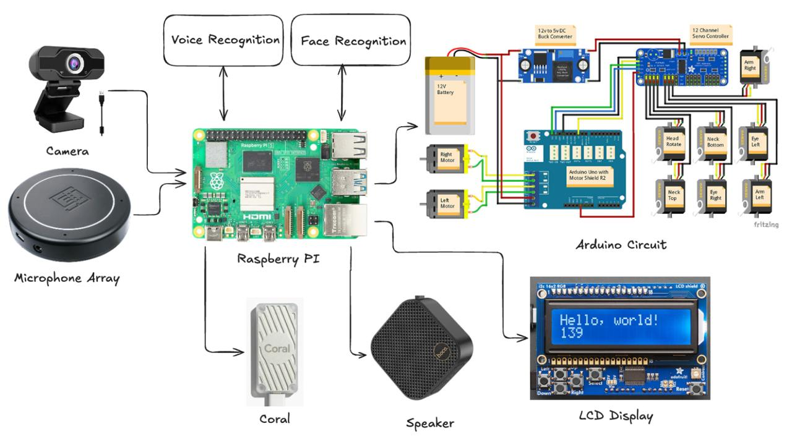

# nu2025_senior_project

## Preface

Hi guys! 👋

This tutorial from your friendly 2024‑2025 crew explains:

1. **What this project is about**
2. **Why we did it and why _you_ are continuing it**
3. **What progress we made during the 2024‑2025 year**
4. **What problems we faced & what you need TODO to finish**
5. **AND OVERALL** how to use this repository to get started with your lovely ❤️ senior project ❤️

Soooo… let’s get started!

---

## Chapter 1 – The Idea 💡

When we were seeking a senior‑project topic, our **lovely Professor Fazli** (with the warmest will) presented an idea: **Create the SMARTEST ROBOT DOG.**  
(It eventually shapeshifted into _WALL‑E on legs_… but that’s Chapter 3.)

### First‑meeting Notes

```text
Fazli:

Проект: Бюджетный робо‑пес

Описание: Создание многофункционального робота‑пса с использованием подручных средств.

Задачи:
1. Computer Vision – Робот должен уметь распознавать лица людей.
2. Voice Detection – Робот должен определять местоположение человека по его голосу.
3. Hardware:
   • Построить робота с использованием 3D‑принтера и доступных материалов.
   • Робот должен уметь ходить и определять расстояние до человека, чтобы следовать рядом.
4. Bonus:
   • Робот должен уметь учиться новым командам, например, команде «сидеть».
   • Робот оснащен SSD на 512 GB, что позволяет добавить функции записи видео и аудио.

Цель: В мире уже существуют роботы‑собаки, но они дорогие. Профессор хочет, чтобы мы создали
робопса, который будет в десять раз дешевле, но с функциональностью не хуже дорогих моделей.

Преимущества:
• Профессор оплачивает все материалы.
• Благодаря связям профессора можно обратиться за помощью с hardware к специалистам.
```

In short: **Build something fun _(but time-consuming)_ and interesting _(but very time-consuming)_, with limitless parts budget.**

---

## Chapter 2 – Why We Chose It & Why You Should Too 🤔

### 1. A Lot of Experience in Different Fields

No need to be an expert; you’ll learn as you go. All you need is passion, love for experimentation, and a little (BIG) help from ChatGPT.

**1) 3D Printing**  
• None of us had printed before, yet we printed and built WALL‑E. You’ll get the physical bot from the professor (upgrade it, break it, print spares – go wild).

**2) Programming the Robot**  
• Raspberry Pi 5 + Arduino = brain & nerves. We scripted various funky moves triggered by voice.

**3) AI and Software**  
• _Face Recognition_ – Coral AI, lightweight enough for Raspberry Pi.  
• _Voice Recognition_ – detects & recognizes voice commands, then makes WALL‑E play cute sounds.  
• _Sound Triangulation_ – Microphone array converts sound to angles; the bot turns toward whoever yells “WALL‑E!”

### 2. Lovely Professor & Legend Aibek

1. Super‑friendly supervisors who listen, feedback, and rescue you when stuck. Prof. Fazli can summon hardware gurus at will.
2. **Aibek** is a geek who can solve almost any technical problem, so don’t be shy to text him at 3 A.M. _(He will write back during 3 working days (maybe...))_.  
   _(P.S. Just kidding, sorry Aibek, we love you! You are the best!)_ ❤️

### 3. Creativity & Experimenting

You’re always free to add, remove, or change anything—just avoid building Skynet. Great creativity + lots of time = success (time was our nemesis).

If you crave multidisciplinary chaos, helpful mentors, and creative freedom, **this project is for you.** Make It Great Again™.

---

## Chapter 3 – 2024‑2025 Progress 🛠

### 1. Research & Experimenting

70 % of our timeline was ~googling~ _research_. Raspberry Pi horsepower ≠ workstation, so many off‑the‑shelf solutions needed brutal adaptation.

### 2. Software Part

- **Face Recognition** – See `face_recognizer.py` (based on Coral AI & <https://github.com/bergerda1/PiFaceRecognition>).  
  How‑to run? Check Chapter 5. ✔️
- **Sound Triangulation** – After much caffeine, we bought a mic array that spits out angles. Works like a charm (except when it doesn’t). 🔧
- **Voice Recognition** – [Picovoice](https://picovoice.ai/). Good luck 😉. Maybe beg the prof for a paid plan if the free tier croaks.

### 3. Hardware Part

We printed & assembled WALL‑E following this glorious guide:  
<https://wired.chillibasket.com/3d-printed-wall-e/>  
Break something? Re‑print, re‑screw, repeat. Good luck!!!

_Other two chapters will be written by another guy, therefore it may be boring. I wish you luck with this project and hope it will give you not only good grades, but epic experience. GHLF!!!_ – **Raiymbek**

---

## Chapter 4 – Areas for Improvement 🔧

### Hardware

- **Size Limitation** – WALL‑E cannot fit all project components inside.
  - Use a **larger 3D model** _or_ reduce the number of hardware parts.
- **Structural Instability** – WALL‑E’s construction is fragile.
  - Remodeling or full rebuild recommended _(time‑consuming but worth it)._ 🛠️

### Speech Detection

- **Accuracy Issues** – Rhino Speech‑to‑Intent is sensitive to noise; accuracy unmeasured.
  - Test in multiple environments (dorm, lab, noisy hallway).
- **Limited Vocabulary** – Rhino supports only a predefined set of names.
  - Swap in a better speech‑recog model that runs on Pi _or_ offload via API (adds cloud complexity).

### Movement

- **Lack of Autonomy** – WALL‑E cannot move autonomously or dodge obstacles.
  - Add sensors (ultrasonic, lidar, spicy AI vision) + code brains.
- **Rotation Inaccuracy** – Current turns use rough time estimates (~5 s per 360°).
  - Calibrate with encoders or IMU for real angles.

### Speech & Movement Combo

- **Motor Noise Interference** – Voice commands fail while servos scream.
  - Noise suppression, directional mics, or pause‑move‑listen cycles.

### Speaker

- **Bluetooth Drama** – BT speaker works only without `sudo`.
  - Go old‑school: 3.5 mm jack or USB.
  - Or figure out non‑sudo magic / replace the speaker entirely.

---

## Chapter 5 – Mic Array & Arduino Configuration 🔌🎙️

> _Configure the mic array and Arduino code to make WALL‑E hear the world and react like a true good boy._

**Links for reference**

- Wall-E repo: <https://github.com/chillibasket/walle-replica>
  - Here you can find anything about Wall-E assemble and configuration
  - instead of motor shield r2, we used l298n motor driver, so use given `L298NMotorController` class in this repo in place of `MotorController` class from the main repo.
  - Wiring is up to you guys, good luck ;)
- Micro Array: <https://wiki.seeedstudio.com/ReSpeaker-USB-Mic-Array/>

### Requirements

- **Python** < 3.10 (use a virtual environment to stay sane)

### Getting Started

0. **Look into setup**



1. **Clone the repository**
   ```bash
   git clone https://github.com/shinbay-almaz/nu2025_senior_project.git
   cd nu2025_senior_project
   ```
2. **Add `tuning.py`** from the mic‑array repo (drop it into the project root).
3. **Install Python modules**
   ```bash
   pip3 install -r requirements.txt
   ```
   If something is still missing, append it to `requirements.txt` and rerun the command.
4. **Run the main script**
   ```bash
   sudo python3 main.py voice
   ```
   **If it fails:**
   - Verify _everything_ is plugged in (camera, LCD, Arduino, mic array, wires, etc.).
   - Make sure your Python version is **≤ 3.9.x**.

---

## Credits 🙏

| Role             | People                                                                                                        |
| ---------------- | ------------------------------------------------------------------------------------------------------------- |
| Original authors | **Raiymbek Nazymkhan**, **Almaz Shinbay**, **Zhibek Rakhymbekkyzy**, **Sultan Rzagaliyev**, **Aibar Ibrayev** |
| Supervisors      | **Prof. Fazli** (idea machine), **Aibek** (debug deity)                                                       |

Special thanks to caffeine, late‑night Stack Overflow, and ChatGPT.

---

## License 📜 (Just for formality)

MIT – because robots should be free (and we’re too tired to lawyer up).

---

_Made with ❤️ by NU CS Class of 2025._
